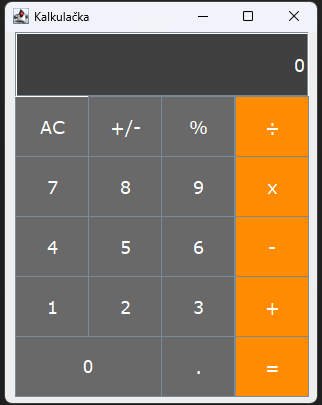

# Calculator
Jednoduchá kalkulačka, která umí provést základní početní operace mezi dvěma po sobě zadanými čísly, +/- a procenta. Vytvořeno pro CLI i GUI. Kalkulačka je graficky zpracována pomocí JFrame a zbytek pomocí jazyka Java.

### Ukázka
